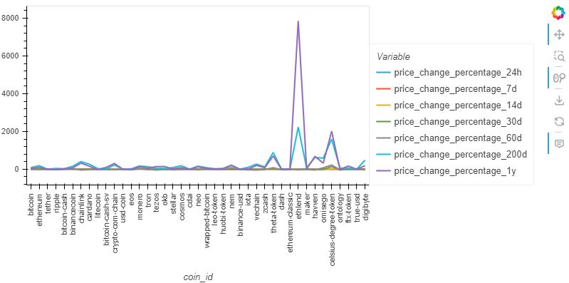
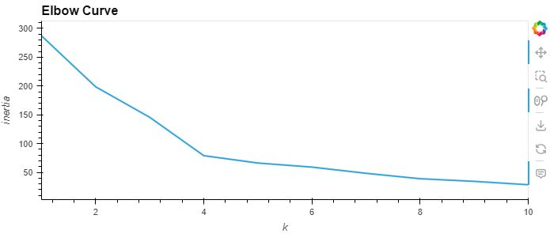
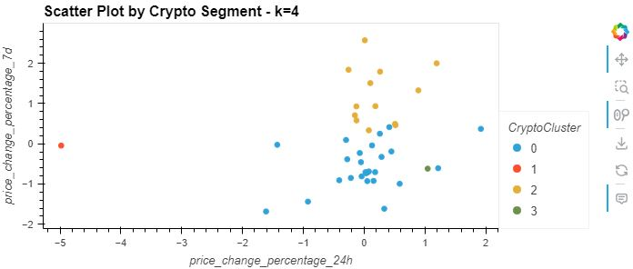
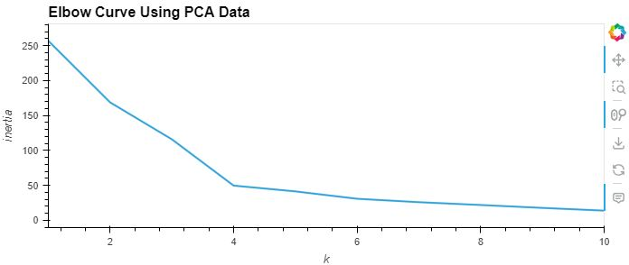
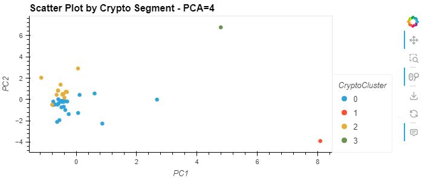

# Crypto Clustering
## Overview
In this project, machine learning is applied to cryptocurrency data to identify any clusters using unsupervised learning.

## Data
The first task that needed to be done was to import the data from the provided CSV file and load it into a Pandas DataFrame. A summary statistics table was then created to look further into the information provided. After this was done the data was then plotted to take a look at the what is contained in the DataFrame.  
 

## Data Preparation
Next the original data was then standardized using the `StandardScaler` moduel from `scikit-learn`. A new DataFrame was then created using the scaled data.

## Elbow Plot
Using the original scaled data, an elbow plot was then created in order to find the best value for k which turned out to be k=4 as shown below.  

## Scatter Plot
The Cryptocurrencies were then clustered using a scatter plot with the k value that was found previously.  

## Optimizing the CLusters using PCA
Using the original scaled DataFrame, PCA was performed and reduced the features to three principal components. The total explained variance of the three principal components was around 89.5%. A new dataframe was then created using the the PCA in order to use forr further analysis.

## PCA Elbow Plot
Using the PCA data, an elbow plot was created to find the best value for k which turned out to be k=4. This is the same value for k that was found using the original scaled data.  

## PCA Scatter Plot
The cryptocurrencies were then clustered using a scatter plot once again using the k value that was previously found.  

## Composite Plots
Composite plots are shown below to compare both the elbow plots and the scatter plots.  

 

## Technologies Used
[Python 3.10 or higher](https://www.python.org/)  
[Pandas](https://pandas.pydata.org/)  
[Scikit-learn](https://scikit-learn.org/stable/index.html)

